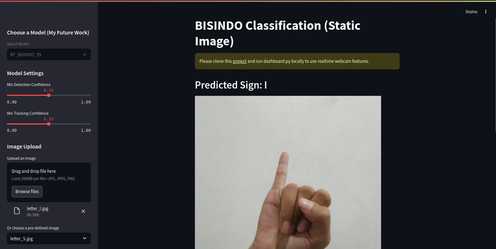
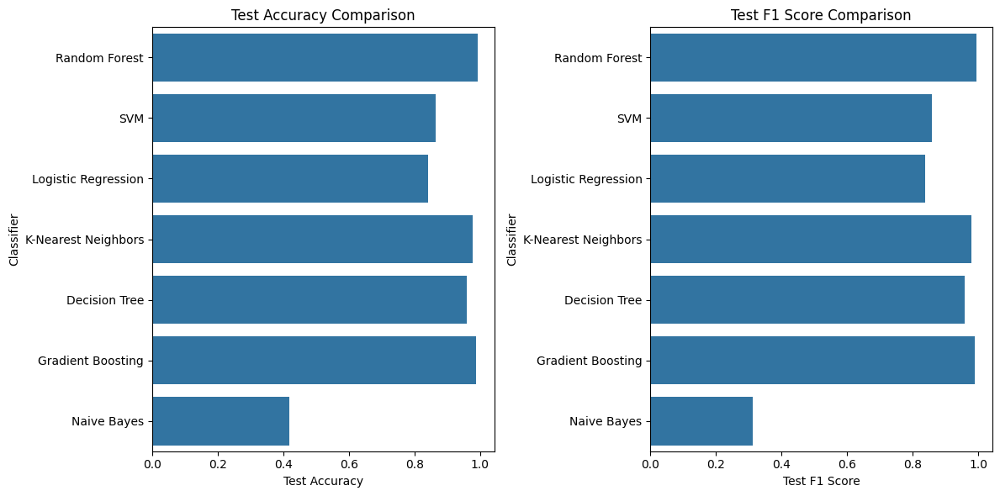
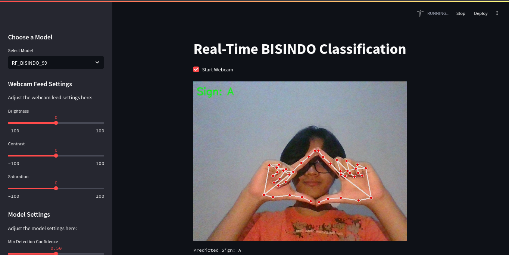
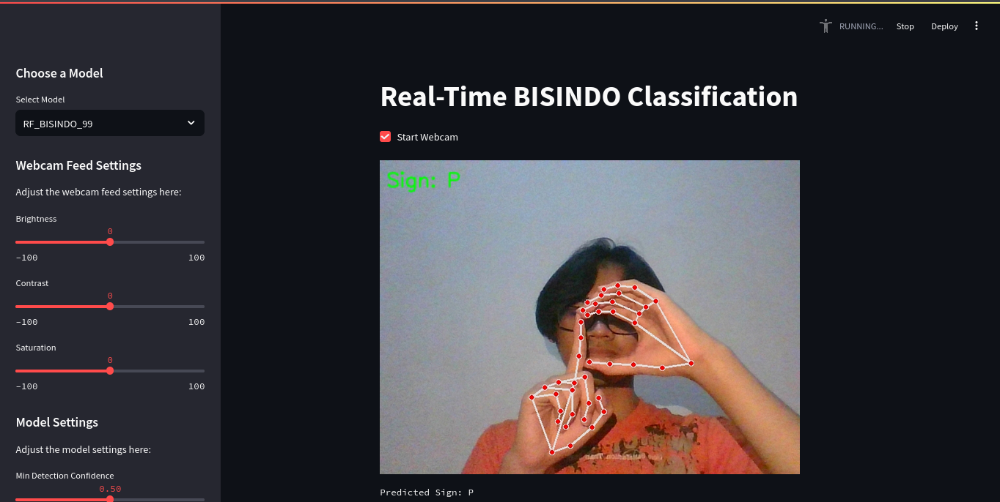

# 🤞 Real-time BISINDO (Bahasa Isyarat Indonesia) Classification


## 🌟 Project Overview

Welcome to the Real-time BISINDO (Bahasa Isyarat Indonesia) Classification project! In this project, I built a machine learning model to classify the BISINDO alphabet in real-time using hand landmarks detection. I used the mediapipe library to extract hand landmarks from the images and trained a Random Forest model to classify the alphabet.


## 💡 Demo

You can check out the demo of the project on Streamlit [Here]((https://realtime-bisindo-classification.streamlit.app/))

[https://realtime-bisindo-classification.streamlit.app/](https://realtime-bisindo-classification.streamlit.app/)

But streamlit is not supported for real-time video, so you can run the project locally to see the real-time classification. As an alternative, you can upload an image to classify the BISINDO alphabet.



## 🎯 Objective

The objective of this project is to classify the BISINDO (Bahasa Isyarat Indonesia) alphabet in real-time using hand landmarks detection and machine learning.

## 🧪 Dataset

I use the [Bahasa Isyarat Indonesia (BISINDO) Alphabets](https://www.kaggle.com/datasets/achmadnoer/alfabet-bisindo) dataset from Kaggle. This dataset contains 26 classes of images, each representing a letter in the BISINDO alphabet.

The data files contain 1:1 scaled images of Indonesian sign language, from A to Z.

There are three backgrounds used in taking the image, namely a plain white shirt, a white wall, and a white dot-patterned shirt. The point of view of the image taken is the front view with the distance between the object and the lens approximately 70 cm.

During the shooting process, four images were obtained for each background, which means 12 images for each alphabet. The total images from letters A to Z obtained are 312 images.


## 🖥️ Implementation

this project uses Python with the following key libraries:

- scikit-learn for machine learning algorithms and metrics
- numpy for numerical operations
- pandas for data manipulation
- matplotlib and seaborn for data visualization
- imgaug for image augmentation
- mediapipe for hand landmarks detection
- opencv-python for image processing

Here's the workflow of the project:
1. Load the dataset and preprocess the images
2. Augment the images using imgaug with 50 images each
3. Extract hand landmarks from the images using mediapipe
4. Extract features from the hand landmarks
5. Train and evaluate machine learning models
6. Compare the models and choose the best one
7. Use OpenCV to capture real-time video and classify the BISINDO alphabet


## 📊 Results

I evaluated each model with accuracy as main metric. Here are the results:



Check out my detailed analysis and visualizations in the Jupyter notebook!

Here's the result I get with the best model (Random Forest, 99%):


Here's some screenshots of the real-time classification:






## 🛑 Limitation

Here are some limitations of the project:
- The system is very slow because of the hand landmarks detection, and model classification
- The model is not very accurate because of the small dataset (Only use augmented images)

## 📈 Future Work

Here are some ideas for future work:
- Use more real dataset (Not only augmented images)
- Improve speed and accuracy of the model
- Implement the model on a mobile app
- experiment with removing `z axis` from the hand landmarks

## 🚀 Getting Started

1. Clone this repository:
   ```
   git clone https://github.com/KrisnaSantosa15/realtime-bisindo-classification.git
   ```

2. Install the required packages:
   ```
   pip install -r requirements.txt
   ```

3. Run the Jupyter notebook

4. Run `streamlit run dashboard/dashboard.py` to run the Streamlit dashboard

## 🤝 Contribute

Feel free to fork this repository and submit pull requests. All contributions are welcome!

## 📚 Learn More

For a detailed walkthrough of the code and methodology, check out the Jupyter notebook in this repository.

## 📄 License

This project is [MIT](LICENSE) licensed.

---

If you find this project interesting, don't forget to give it a star! ⭐